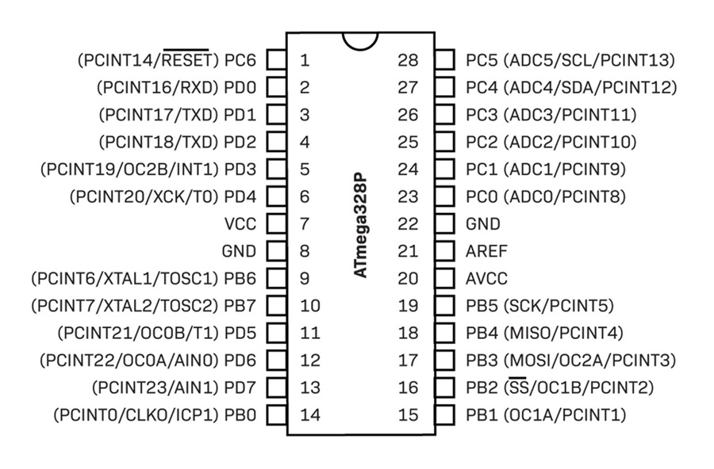

# Bare ATmega328P @ 3.3 V, 8 MHz — Arduino + Atmel-ICE + Raspberry Pi UART (multi-node) Quickstart

Run **ATmega328P** chips on a breadboard using the **internal 8 MHz RC** oscillator at **3.3 V**, program them with an **Atmel-ICE** from the **Arduino toolchain**, and talk to them over **Raspberry Pi UART**. Includes a tiny serial echo sketch and helper scripts.

> No crystal/caps required for the clock. The internal 8 MHz RC is used.

---

## Contents

```
sketches/
  serial_echo/
    serial_echo.ino     # "READY"/hello/echo at 38400 baud

scripts/
  program_one.sh        # Burn fuses + compile + upload to a single chip
  program_all.sh        # (optional) Batch version; loops over N chips
  pi_test.sh            # Simple UART poke tool for the Pi

README.md
LICENSE
.gitignore
```

---

## Hardware you need

* ATmega328P-PU (DIP-28) x N
* **Atmel-ICE (AVR)** with 2×3 ISP cable
* Breadboard + jumpers
* Regulated **3.3 V** supply
* Decoupling: **0.1 µF** near VCC; tie **AVCC → VCC**; optional **0.1 µF** AREF→GND if you use ADC
* Raspberry Pi (40-pin header) for UART testing

> **Important:** Atmel-ICE does **not** power the target. Provide 3.3 V to VCC (pin 7) **and** AVCC (pin 20). Common GND.

---

## Arduino CLI setup (MiniCore)

```bash
arduino-cli config init
arduino-cli config set board_manager.additional_urls \
  https://mcudude.github.io/MiniCore/package_MCUdude_MiniCore_index.json

arduino-cli core update-index
arduino-cli core install MiniCore:avr
```

Set board + programmer:

```bash
# 8 MHz internal RC, BOD 2.7 V, no bootloader
FQBN='MiniCore:avr:328:clock=8MHz_internal,BOD=2v7,bootloader=no_bootloader'

# Programmer (choose one your system recognizes)
PROG='atmel_ice'      # or: atmelice_isp
```

List available programmers for this board:

```bash
arduino-cli board details -b MiniCore:avr:328 | sed -n '/Programmers:/,/^$/p'
```

---

## Wiring setup

### ISP (Atmel-ICE ↔ ATmega328P)

| Atmel-ICE AVR pin | ATmega328P DIP pin             |
| ----------------- | ------------------------------ |
| 1 (SCK)           | 19 (PB5 / SCK)                 |
| 2 (GND)           | 8 or 22 (GND)                  |
| 3 (MISO)          | 18 (PB4 / MISO)                |
| 4 (VTG)           | 7 (VCC) + tie 20 (AVCC) to VCC |
| 6 (nRESET)        | 1 (PC6 / RESET)                |
| 9 (MOSI)          | 17 (PB3 / MOSI)                |

Power/decoupling (minimum):

* VCC (pin 7) → **3.3 V**
* AVCC (pin 20) → **3.3 V**
* GND (pins 8/22) → **GND**
* 0.1 µF cap near VCC–GND

Optional LED:

* **D13** / PB5 (pin 19) → LED (series resistor) → GND

### UART (ATmega328P ↔ Raspberry Pi primary UART)

| ATmega328P pin | Function | Pi 40-pin header       |
| -------------- | -------- | ---------------------- |
| 3 (PD1)        | TX       | GPIO15 / RXD0 (pin 10) |
| 2 (PD0)        | RX       | GPIO14 / TXD0 (pin 8)  |
| 8/22           | GND      | Any GND (e.g., pin 6)  |

> Free the Pi’s serial from the login shell (raspi-config → Serial): disable shell, enable hardware. Device is typically `/dev/serial0`.

---

## Raspberry Pi multi-UARTs (Pi 4)

Enable extra UARTs (Pi OS Bookworm path shown):

```ini
# /boot/firmware/config.txt  (use /boot/config.txt on older releases)
enable_uart=1
dtoverlay=uart2
dtoverlay=uart3
dtoverlay=uart4
dtoverlay=uart5
```

| UART  | TX GPIO | RX GPIO | Header pins (TX,RX) | Linux device   |
| ----- | ------- | ------- | ------------------- | -------------- |
| uart2 | GPIO0   | GPIO1   | (27, 28)            | `/dev/ttyAMA2` |
| uart3 | GPIO4   | GPIO5   | (7, 29)             | `/dev/ttyAMA3` |
| uart4 | GPIO8   | GPIO9   | (24, 21)            | `/dev/ttyAMA4` |
| uart5 | GPIO12  | GPIO13  | (32, 33)            | `/dev/ttyAMA5` |

Cross-wiring rule for any UART:

* **Pi TX → ATmega RX (pin 2)**
* **Pi RX ← ATmega TX (pin 3)**
* **GND ↔ GND**
* **3.3 V** logic only (power the ATmega at 3.3 V to avoid level shifting)

---

## Quick start (burn, build, upload)

```bash
arduino-cli burn-bootloader -b "$FQBN" -P "$PROG" --verbose
arduino-cli compile -b "$FQBN" sketches/serial_echo
arduino-cli upload  -b "$FQBN" -P "$PROG" sketches/serial_echo
```

---

## Test from the Pi

With the MCU wired to `/dev/serial0` (or a `/dev/ttyAMA*` from the table):

```bash
chmod +x scripts/pi_test.sh
scripts/pi_test.sh /dev/serial0
```

Expected:

* On reset: `READY`
* Send `h` → `hello`
* Send `t` → increasing `millis()`
* Any other byte → echoed back

Raw test (no script), example for `/dev/ttyAMA3`:

```bash
stty -F /dev/ttyAMA3 38400 -icrnl -ixon -echo
( cat < /dev/ttyAMA3 & )
printf "h" > /dev/ttyAMA3
printf "t" > /dev/ttyAMA3
```

---

## Troubleshooting

* **Vtarget shows 0.0 V then \~3.3 V:** first read is before measurement; the later value is the real one.
* **“Bad response to AVR sign-on”:** usually wiring, missing AVCC-to-VCC, or wrong clock fuses.
* **Slow ISP clock:** pass through to avrdude, e.g. `arduino-cli … -- -B 8`.
* **debugWIRE set:** DWEN fuse disables ISP; clear via a debugWIRE session or HV programmer.
* **External clock fuse set:** provide a temporary clock to XTAL1 (pin 9) or add a crystal once to recover, then reburn fuses to 8 MHz internal RC.

---

## ATmega328P pinout



---

## License

MIT (see `LICENSE`).
